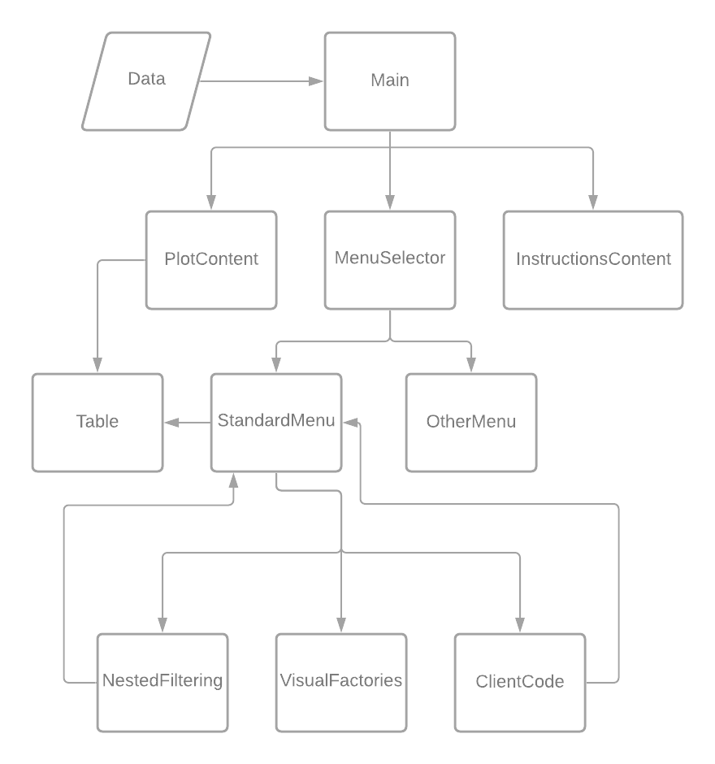

Interactive Data Visualization 
------------------------------
-----------------------------------------------------------

CONTENTS OF THIS FILE
---------------------

 * Introduction
 * Requirements
 * Installation
 * Configuration
 * Troubleshooting
 * FAQ
 * Developers

-----------------------------------------------------------
INTRODUCTION
------------

This program is specifically designed to Visualize data in an interactive manner. The program is originally made for Arman Naseri Jahfari, a PhD'er at the TU Delft research group Pattern Recognition and Bioinformatics.  

 * For a full description of the module, visit the project page:
   
   https://gitlab.ewi.tudelft.nl/cse2000-software-project/2020-2021-q4/cluster-00/interactive-data-visualization/interactive-data-visualization
 * For a detailed overview of the software report visit:
    
    doc/Software_Report.pdf
     
 * For the status of the pipeline visit:
    
    
 * For the coverage report visit:
   
    

-----------------------------------------------------------
REQUIREMENTS
------------

This program requires the following modules:

* Dash
* Dash_OOP_components
* Dash_html_components 
* Dash_core_components 
* Dash_bootstrap_components
* Pandas
* Numpy

-----------------------------------------------------------   
INSTALLATION
------------
 
 * Install as you would normally install a contributed module.
   

-----------------------------------------------------------
CONFIGURATION
-------------
 
 * To run the program run the Main.py file. 
   
-----------------------------------------------------------
TROUBLESHOOTING
---------------

 * If the menu does not display, check the following:

   - if you're working with new data files, reload the page
    
-----------------------------------------------------------
Extendability
-------------

This program is specifically designed to be extendable. In particular, it can be extended in two ways.

1.  **Extend Modification dataframe** 
 
In the map python/oop/Components/ClientCode The client can add code. This code soul purpose is to modify the current data and return a Pandas dataframe. 

*Requirements:*
  * Input and output need to be Pandas dataframe. 
  * A button needs to be added to the layout method and the GUI logic needs to be added to update_processed_data method. Both these methods are to be found in python/oop/Components/Menu/StandardMenu.py

*Steps*
  * Make a new method in client code
  * Requirement: The method input and output is required to be a Pandas dataframe.
  * Make a new button in StandardMenu.py in the layout method.
  * Search in the layout method for the comment CLIENT CODE BUTTON HTML LAYOUT and follow the required steps
  * Add the back-end of the GUI to the update_processed_data method in StandardMenu.py and follow the required steps

2.  **Extend Graphical User Interface (GUI)** 

The interactive data visualiser can easily be extended, since all code is Object-Oriented Structured.
The Structure of the classes are visible below:

Code can be extended by adding other Menu's to the the MenuSelector or extending already existing menu's such as StandardMenu. To add a new class to an existing class initialise the new class in the init. And put new_class.layout(params) in the layout of the class you want to extend. The new class is now integrated with the old one. IMPORTANT: All id's in all classes need to be unique.

*Requirements:*
  * Fully understanding Dash and Dash_OOP_components and  experiences with Pandas dataframes

-----------------------------------------------------------
Developers
-----------

Made by:
* Glenn van den Belt 
* Shaan Hossain
* Joost Jansen
* Adrian Kuiper 
* Philip Tempelman

